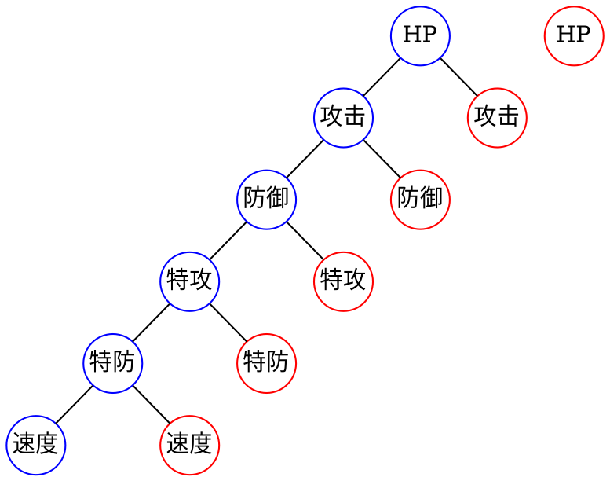

《宝可梦 剑/盾》发售两周了，在打通了非常尬的主线剧情后，开始了宝可梦孵蛋养殖计划。宝可梦孵蛋是指是把两只不同性别不同蛋组的宝可梦放在寄放屋，过一段游戏时间后就能获得一个宝可梦蛋，孵化宝可梦蛋可以获得一只一级的宝可梦。虽然遍地就能抓宝可梦，但通过孵蛋的方式可以获得特定遗传技能、特定特性、各项属性MAX的完美宝可梦。
<!--more-->

然而在拿着两只5v属性的多龙梅西亚孵了一整天蛋之后我傻了，生出6v宝可梦的概率也太低了点吧。在某个网站上查了概率分布，它给出的生出6v宝可梦的概率是1.0417%，然而我感觉我已经孵了200个蛋了，所以我打算写个程序验证一下这个数据的正确性。


### 前提
6项个体值每项的区间范围是[0, 31]，个体值为31就称为v，6v就是指全部6项个体值都为31。现在有两只5v属性的宝可梦，非v个体值为0且属性错位，带有红线，红线是一个游戏道具，可以让子代宝可梦随机遗传父母双方五项个体值。为了简化问题，我们假设个体值只有0和1两个值，1就是v，0就是非v。根据条件可以知道生出宝可梦只能是3v、4v、5v和6v，程序要能给出4种情况下的概率。

### 分析
如果所有个体值都遗传自父母，那么每项值的可能性是2（父或母），总共6项的组合就是2<sup>6</sup>=64种情况，可以想象成是两棵完全二叉树，二叉树的每一层可以理解成一项个体值，完全二叉树第六层结点个数是2<sup>6-1</sup>=32，因为有两棵结果就刚好是32*2=64。



### 代码
使用长度为6的数组表示个体值，父母的个体值分别是`[1, 1, 1, 1, 1, 0]`和`[0, 1, 1, 1, 1, 1]`，由于只有5项能遗传父母，另外一项个体值是[0-31]区间内随机，所以用一个32位长的数组表示这个区间值，前30个元素值为0，最后一个元素值为1。两层循环外层是随机到的个体值数，范围是[0, 31]，内层循环是随机到的位置，范围是[0, 6]。

```go
package main

import "fmt"

func main() {
	var (
		father     = []int{1, 1, 1, 1, 1, 0}
		mother     = []int{0, 1, 1, 1, 1, 1}
		children   [][]int
		scope      = make([]int, 32)
		statistics = make(map[int]int64)
		fill       func([]int, int, int)
	)

	scope[31] = 1

	fill = func(ability []int, index, fixed int) {
		if index >= len(ability) {
			branch := make([]int, 6)
			copy(branch, ability)
			children = append(children, branch)
			return
		}

		if index == fixed {
			fill(ability, index+1, fixed)
			return
		}

		ability[index] = father[index]
		fill(ability, index+1, fixed)
		ability[index] = mother[index]
		fill(ability, index+1, fixed)
	}

	for i := 0; i < 6; i++ {
		ability := make([]int, 6)
		for _, value := range scope {
			ability[i] = value
			fill(ability, 0, i)
		}
	}

	for _, child := range children {
		sum := 0
		for _, v := range child {
			sum += v
		}
		statistics[sum]++
	}

	fmt.Printf("IVs\tPercentage\n")
	fmt.Printf("6IV\t%.4f%%\n", float64(statistics[6])*100/float64(len(children)))
	fmt.Printf("5IV\t%.4f%%\n", float64(statistics[5])*100/float64(len(children)))
	fmt.Printf("4IV\t%.4f%%\n", float64(statistics[4])*100/float64(len(children)))
	fmt.Printf("3IV\t%.4f%%\n", float64(statistics[3])*100/float64(len(children)))
}
```

### 结论
结果和上面给出来的一致，6v的概率就是1.0417%，真的只是脸黑而已_(:зゝ∠)_。


.
.
.
.
.
.
.
.
.
.

十分钟后

